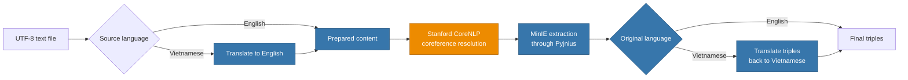

<div align="center">

# 🔎 Text Extraction

### Turn English and Vietnamese text into structured relational triples

Hybrid **Python + Java NLP pipeline** powered by Stanford CoreNLP, MinIE, Pyjnius,
and automatic Vietnamese translation.

[](https://www.python.org/)
[](https://openjdk.org/)
[](https://stanfordnlp.github.io/CoreNLP/)
[](#-quality--testing)
[](#-usage)

[Features](#-features) · [Architecture](#-architecture) · [Quick start](#-quick-start) · [Configuration](#%EF%B8%8F-configuration) · [Development](#-development)

</div>

---

## ✨ What is Text Extraction?

Text Extraction converts unstructured prose into **subject–relation–object triples**
that can feed knowledge graphs, search systems, semantic analysis, or downstream AI
applications.

```text
Input       Barack Obama was elected president. He served two terms.
Coreference Barack Obama was elected president. Barack Obama served two terms.
Triple      (Barack Obama; served; two terms)
```

Vietnamese input is translated to English before NLP processing, then the extracted
triples are translated back to Vietnamese automatically.

## 🚀 Features

| Capability | What it provides |
| --- | --- |
| 🇻🇳 Vietnamese support | Detects Vietnamese diacritics, translates input to English, and translates results back |
| 🔗 Coreference resolution | Replaces pronouns with representative entities using Stanford CoreNLP |
| 🧠 Open information extraction | Produces relational triples through MinIE and Pyjnius |
| ⌨️ Command-line interface | Scriptable pipeline suitable for automation and batch workflows |
| 🖥️ Desktop interface | Responsive Tkinter GUI with progress logs and artifact settings |
| ⚙️ Flexible configuration | Supports environment variables, workspace settings, and artifact download URLs |
| 🛡️ Defensive runtime | Validates inputs and JAR files, uses atomic settings writes, timeouts, and clear errors |
| ✅ Tested architecture | Python unit tests plus Java UTF-8 and real CoreNLP integration tests |

## 🧭 Architecture



The Java coreference process and the Python/MinIE JVM are isolated from each other.
This prevents classpath collisions and keeps artifact configuration predictable.

## ⚡ Quick start

### 1. Install the Python package

```bash
git clone https://github.com/alexmerex/TextExtraction.git
cd TextExtraction

python -m venv .venv
```

Activate the environment:

```bash
# Windows PowerShell
.venv\Scripts\Activate.ps1

# macOS / Linux
source .venv/bin/activate
```

Install Text Extraction:

```bash
python -m pip install -e .
```

### 2. Build the Java coreference CLI

```bash
cd java

# Windows
gradlew.bat shadowJar

# macOS / Linux
./gradlew shadowJar

cd ..
```

The executable fat JAR is created at:

```text
java/build/libs/text-extraction-java.jar
```

### 3. Configure MinIE

> [!IMPORTANT]
> MinIE is not bundled with this repository. Provide a **fat JAR containing MinIE
> and all of its runtime dependencies** before running extraction.

The fastest option is an environment variable:

```bash
# Windows PowerShell
$env:TEXT_EXTRACTION_MINIE_JAR = "C:\tools\minie-fat.jar"

# macOS / Linux
export TEXT_EXTRACTION_MINIE_JAR=/opt/minie/minie-fat.jar
```

### 4. Extract triples

```bash
text-extraction input.txt --workspace output
```

Results are written to `output/triples.txt`.

## 🖥️ Usage

### Command line

```text
usage: text-extraction [-h] [--workspace WORKSPACE]
                       [--source-language {auto,en,vi}] [--skip-coref]
                       input_file
```

Examples:

```bash
# Automatic Vietnamese/English detection
text-extraction story.txt --workspace results

# Force Vietnamese for text without diacritics
text-extraction story.txt --source-language vi --workspace results

# Extract without the Java coreference stage
text-extraction story.txt --skip-coref --workspace results
```

### Desktop GUI

```bash
text-extraction-gui
```

The GUI lets you select an input file, configure Java and MinIE artifacts, monitor
pipeline progress, and inspect the extracted triples. Processing runs outside the UI
thread, so the window stays responsive during model loading and extraction.

## ⚙️ Configuration

Configuration is read from `<workspace>/settings.json`:

```json
{
  "java_path": null,
  "java_cli_jar": null,
  "minie_jar_path": "C:/tools/minie-fat.jar",
  "minie_url": null
}
```

| Setting | Description |
| --- | --- |
| `java_path` | Optional path to the Java executable; defaults to `java` on `PATH` |
| `java_cli_jar` | Optional CoreNLP CLI JAR override; defaults to the repository build output |
| `minie_jar_path` | Absolute path or workspace-relative path to the MinIE fat JAR |
| `minie_url` | Optional HTTP(S) URL used to download MinIE into the workspace artifact cache |

MinIE resolution order:

1. `TEXT_EXTRACTION_MINIE_JAR`
2. `minie_jar_path` in `settings.json`
3. Cached/downloaded artifact from `minie_url`

Downloaded artifacts are checked for a valid JAR/ZIP signature before use.

## 📦 Workspace outputs

| File | Purpose |
| --- | --- |
| `content.txt` | English text prepared for NLP |
| `content_afterChange.txt` | Text after Java coreference resolution |
| `triples.txt` | Final extracted triples |
| `language_info.txt` | Detected or explicitly selected input language |
| `settings.json` | Optional workspace-specific configuration |
| `.text-extraction/artifacts/` | Downloaded runtime artifacts |

## 🗂️ Project structure

```text
TextExtraction/
├── java/                         # Gradle Java application
│   ├── gradle/wrapper/           # Reproducible Gradle toolchain
│   └── src/
│       ├── main/java/            # CoreNLP CLI and coreference logic
│       └── test/java/            # Java unit/integration tests
├── src/text_extraction/
│   ├── ui/                       # Responsive Tkinter desktop UI
│   ├── cli.py                    # Command-line entry point
│   ├── config.py                 # Resolved pipeline configuration
│   ├── downloader.py             # Validated MinIE artifact download
│   ├── minie.py                  # Lazy Pyjnius/MinIE integration
│   ├── pipeline.py               # Pipeline orchestration
│   ├── settings.py               # Atomic JSON settings storage
│   └── translate.py              # Language detection and translation
├── tests/                        # Python test suite
├── pyproject.toml                # Package and tooling metadata
└── README.md
```

## 🧪 Quality & testing

Install development dependencies and run the full verification suite:

```bash
python -m pip install -e ".[dev]"
python -m ruff format --check src tests
python -m ruff check .
python -m pytest

cd java
./gradlew clean test shadowJar
```

Current verified baseline:

- **16 Python tests** passing
- **2 Java tests** passing, including real CoreNLP pronoun resolution
- Python wheel builds successfully
- Java fat JAR builds with a valid executable manifest

## 🩺 Troubleshooting

| Problem | Suggested fix |
| --- | --- |
| `MinIE jar not configured` | Set `TEXT_EXTRACTION_MINIE_JAR` or add `minie_jar_path` to workspace settings |
| JAR does not contain MinIE | Use a fat JAR that includes MinIE and every runtime dependency |
| `Java executable not found` | Install a JDK, update `PATH`, or configure `java_path` |
| Java CLI JAR is missing | Run `gradlew.bat shadowJar` or `./gradlew shadowJar` inside `java/` |
| Vietnamese without accents is treated as English | Pass `--source-language vi` |
| Translation fails | Check connectivity and retry; the Google-backed translator may rate-limit requests |
| First Java run is slow | CoreNLP must initialize large NLP models; subsequent processing is normally faster |

## ⚠️ Operational notes

- Translation uses an unofficial Google web-backed provider and can be affected by
  connectivity, rate limits, or upstream changes.
- Pyjnius starts one JVM per Python process. Configure MinIE before importing other
  Pyjnius-based libraries in the same process.
- Stanford CoreNLP models make the Java fat JAR large and require additional memory
  during startup.
- This repository currently has no open-source license. All rights remain with the
  repository owner unless a license is added.

## 🤝 Contributing

Issues and pull requests are welcome. Before opening a pull request, run both the
Python and Java verification commands from [Quality & testing](#-quality--testing).

<div align="center">

Built for practical text-to-knowledge workflows with Python, Java, CoreNLP, and MinIE.

</div>
